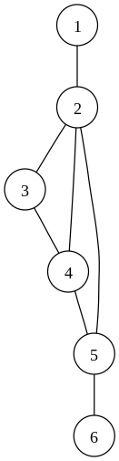

## 1 Кортежи в С#.

Кортежи появились в C# начиная с версии 7.0 с целью обеспечения работы с наборами значений. Основное предназначение кортежей - обобщение нескольких элементов в структуру с упрощенным синтаксисом.

```cs
var tuple = (1, 2, 4, 5);
```

Основные свойства кортежей:

- кортежи определяются с неограниченным количеством элементов.
- Кортежи являются типом значений.
- Кортежи поддерживают операторы = и !=
- Значения кортежей являются общедоступными полями.

**Кортежи могут являться результатом работы методов.**

Также картеж можно удобно декомпозировать на новые переменные.

```cs
var (name, age) = ("Tom", 23);
```

## 2 Понятие графа. Спецификация графа, формы записи.

**Граф** — математическая абстракция реальной системы любой природы, объекты которой обладают парными связями. Граф как математический объект есть совокупность двух множеств — множества самих объектов, называемого множеством вершин, и множества их парных связей, называемого множеством рёбер. Элемент множества рёбер есть пара элементов множества вершин.



Граф может быть представлен (сохранен) несколькими способами:

матрица смежности;
матрица инцидентности;
список смежности (инцидентности);
список ребер.

Граф может быть представлен (сохранен) несколькими способами:

- матрица смежности
- матрица инцидентности
- список смежности (инцидентности)
- список ребер
- геометрическая
